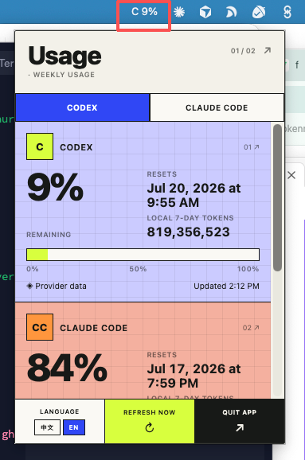

# TokenTracker

**跨平台 AI Token 用量监控工具 · 菜单栏即看即走**

[English](#english) | [下载](https://github.com/HaileyLiuuu/TokenTracker/releases) | [隐私](PRIVACY.md)

TokenTracker 在 macOS 菜单栏（或 Windows 系统托盘）显示 Codex 和 Claude Code 的剩余用量百分比。不打开网页，不翻设置页，扫一眼就知道还剩多少。

---

## 下载

👉 **[前往 Releases 下载最新版本](https://github.com/HaileyLiuuu/TokenTracker/releases)**

| 系统 | 下载文件 |
|---|---|
| macOS（Intel + Apple Silicon） | `TokenTracker_*_universal.dmg` |
| Windows | `TokenTracker_*_x64-setup.exe` 或 `.msi` |

---

## 安装

### macOS

1. 下载 `.dmg` 文件，双击打开
2. 把 `TokenTracker` 拖进 `Applications` 文件夹
3. **首次打开**: 右键点击 → **打开**（不要双击），在弹出的对话框点 **打开**
4. 菜单栏会出现 `C —%` 或 `CC —%`，点击即可查看用量

### Windows

1. 下载 `.exe` 或 `.msi` 安装包，双击运行
2. 如出现 SmartScreen 警告，点 **更多信息** → **仍要运行**
3. 系统托盘会出现 TokenTracker 图标

---

## 使用

| 操作 | 效果 |
|---|---|
| 点击菜单栏图标 | 打开用量面板 |
| 再点图标 / 点面板外空白处 | 关闭面板 |
| CODEX / CLAUDE CODE 标签 | 切换主显示的 provider |
| 中文 / EN | 切换界面语言 |
| REFRESH NOW | 立即刷新 |
| QUIT APP | 退出 TokenTracker |

**前提**: 你需要在同一台电脑上登录过 Codex 或 Claude Code。TokenTracker 自动复用已有登录状态，不需要输入密码或 API key。

---

## 显示什么

| 数据 | 来源 |
|---|---|
| 剩余百分比 + 重置时间 | Codex / Claude Code 官方配额接口 |
| 本机 7 天 Token 用量 | 本地 JSONL 会话日志 |
| Current session（仅 Claude） | 5 小时会话窗口 |
| 按模型拆分（仅 Claude） | Fable / Opus / Sonnet 等 |

---

## 隐私

TokenTracker **不收集、不上传、不分享**你的数据。

它只做三件事:读取本机已有登录凭据（不保存、不传输）、向官方配额 API 发请求（不消耗 token）、扫描本地日志文件统计 token 数量（不读对话内容）。

详见 [PRIVACY.md](PRIVACY.md)

---

## English

**TokenTracker** is a compact menu bar (macOS) / system tray (Windows) utility showing your Codex and Claude Code remaining weekly usage at a glance. No browser tabs, no settings pages — just look at your menu bar.

### Download

👉 **[Get the latest release](https://github.com/HaileyLiuuu/TokenTracker/releases)**

| Platform | File |
|---|---|
| macOS (Intel + Apple Silicon) | `TokenTracker_*_universal.dmg` |
| Windows | `TokenTracker_*_x64-setup.exe` or `.msi` |

### Install

**macOS**: Open `.dmg`, drag to Applications. First launch: **right-click → Open** (unsigned app Gatekeeper workaround).

**Windows**: Run installer. SmartScreen warning → **More info → Run anyway**.

### Usage

- **Click** menu bar icon → panel opens
- **Click outside** or **click icon again** → panel closes
- Tabs switch between Codex / Claude Code
- Footer: language toggle, refresh, quit

**Requirements**: You must be signed in to Codex or Claude Code on this computer. TokenTracker reuses your existing login — zero setup.

### Privacy

Reads your local credentials, never stores or transmits them. Only quota API calls (zero token consumption). Local log scanning extracts token counts without reading conversation content. See [PRIVACY.md](PRIVACY.md).

---

## Tech Stack

Tauri 2 · Rust · HTML/CSS/JS · Swiss Editorial Neo-Brutalist UI

## License

MIT
